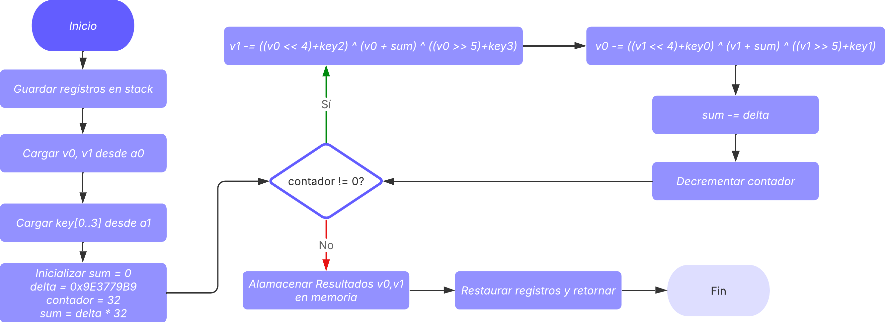

# Documentación Técnica – Proyecto TEA en RISC-V + QEMU

---

## 1. Introducción

### Contexto del proyecto

En este proyecto se desarrolló una implementación del algoritmo **TEA (Tiny Encryption Algorithm)** en arquitectura **RISC-V**. El objetivo es comprender y aplicar conceptos de ingeniería de software a bajo nivel, integrando código en C con funciones críticas en **ensamblador**, todo dentro de un entorno bare-metal emulado con **QEMU** y depurable con **GDB** dentro de un contenedor Docker.

## Estructura del proyecto

```
.
├── Dockerfile
├── run.sh
├── tea_asm_c/           # Implementación C + Ensamblador
│   ├── build.sh
│   ├── data.h
|   ├── degub_test.gdb
|   ├── linker.ld
|   ├── main.c
|   ├── README.md
|   ├── run-qemu.sh
|   ├── startup.s
|   ├── tea_decrypt.s
|   └── tea_encrypt.s
├── tea_asm/             # Implementación en ensamblador puro
│   ├── build.sh
│   ├── decrypt.s
|   ├── degub_test.gdb
│   ├── encrypt.s
│   ├── linker.ld
│   ├── README.md
│   └── run-qemu.sh
└── README.md 
└── DOC.md               # Documentación técnica detallada
```
- `Dockerfile` define la imagen que incluye el emulador QEMU y el toolchain RISC-V
- `run.sh` automatiza la construcción de la imagen y la ejecución del contenedor

## Desarrollo 

### Ensamblador puro (`tea_asm/`) (Pruebas)
En esta carpeta se implementan las funciones encrypt y decrypt del algoritmo TEA, escritas completamente en ensamblador RISC-V.
Permite validar el correcto funcionamiento del cifrado y descifrado en ensamblador antes de integrarlo con C.

### C + Ensamblador (`tea_asm_c/`) (Desarrollo Principal)
Programa en C que llama funciones escritas en ensamblador, demostrando la integración entre ambos lenguajes. Este desarrollo incluye un archivo de inicio (startup.s) que inicializa la pila y llama a la función main de C, ya que los programas C necesitan un entorno de ejecución básico antes de ejecutar el código principal.

---

## 2. Descripción de la arquitectura del software

### 2.1 Separación entre capas C y ASM

Se definió una división clara entre las responsabilidades del código en **C** y en **ensamblador**:

* **C**: entrada/salida, padding PKCS#7, conversión entre bytes y palabras, control de flujo del programa.
* **ASM**: funciones críticas de cifrado (`tea_encrypt`) y descifrado (`tea_decrypt`) con optimización en registros.

### 2.2 Interfaces utilizadas

Las funciones escritas en ASM se declaran en C como externas:

```c
extern void tea_encrypt(uint32_t v[2], const uint32_t key[4]);
extern void tea_decrypt(uint32_t v[2], const uint32_t key[4]);
```

Esto permite llamarlas directamente desde el flujo principal en C.

### 2.3 Justificación de las decisiones de diseño

---

#### 2.3.1 Uso de PKCS#7 en lugar de Zero Padding

Se decidió utilizar **PKCS#7** como esquema de padding por las siguientes razones:

* **Compatibilidad con estándares criptográficos**: PKCS#7 es ampliamente utilizado en protocolos de cifrado modernos (ejemplo: AES en modos CBC), lo que lo hace más robusto y portable.
* **Eliminación inequívoca del relleno**: a diferencia del zero padding, PKCS#7 permite identificar con precisión dónde termina el mensaje real, incluso si el mensaje contiene bytes `0x00`. Esto evita ambigüedad en la decodificación.
* **Seguridad**: aunque TEA no se utiliza hoy en entornos de alta seguridad, emplear un esquema de padding estándar fortalece la calidad pedagógica y acerca el diseño a sistemas reales de criptografía. 

---

#### 2.3.2 Optimización del uso de registros en ensamblador

En las rutinas de **cifrado (`tea_encrypt.s`)** y **descifrado (`tea_decrypt.s`)**, se tomó la decisión de aprovechar registros **salvados (s0–s6)** para almacenar variables persistentes como `v0`, `v1`, y las claves (`key[0..3]`).

* **Ventaja**: se minimizan accesos a memoria, mejorando la eficiencia en bucles con 32 iteraciones.
* **Delta y contador** se almacenan en registros temporales (`t2`, `t3`), reduciendo el número de cargas/referencias dentro del ciclo.

Esto asegura que las funciones sean eficientes y, al mismo tiempo, fáciles de seguir durante las sesiones de depuración con GDB.

---

#### 2.3.3 Separación clara entre C y ASM para modularidad

**Beneficios de esta separación**:

* **Modularidad**: cada parte cumple un rol bien definido, lo que permite modificar o mejorar una sección sin afectar al resto.
* **Reutilización**: las funciones en ASM pueden ser integradas en otros programas en C, siempre que se respete la convención de llamada RISC-V.
* **Depuración sencilla**: la integración con GDB permite inspeccionar si los errores ocurren en la capa de lógica (C) o en las rutinas de cifrado (ASM).

---


## 3. Detalles de implementación

### 3.1 Padding PKCS#7

**Descripción**

PKCS#7 es un esquema de padding usado para rellenar el último bloque cuando el tamaño de los datos no es múltiplo del tamaño de bloque del cifrado (aquí `BLOCK_SIZE = 8`). El valor del byte de padding es el número de bytes añadidos y todos los bytes añadidos tienen ese mismo valor. Si los datos ya son múltiplo del bloque, se añade un bloque completo de padding con valor igual al tamaño del bloque (8).

**Algoritmo**


---

### 3.2 Remove PKCS#7

**Descripción**

Para quitar el padding PKCS#7 se inspecciona el último byte del bloque: su valor indica cuántos bytes del final son padding. Se verifica que todos esos `paddingSize` bytes realmente tengan ese mismo valor. Si la verificación falla (valor fuera de rango, o bytes distintos), se considera padding inválido.

**Algoritmo**


---

### 3.3 Conversión entre bytes y palabras

#### 3.3.1 `bytes_to_words`

**Descripción**
Convierte un bloque de **8 bytes** (64 bits) en **dos palabras de 32 bits**.
La conversión se hace en **big-endian** (el primer byte es el más significativo).

**Algoritmo**

* `v[0]` ← combina `bytes[0..3]`.
* `v[1]` ← combina `bytes[4..7]`.

#### 3.3.2 `words_to_bytes`

**Descripción**
Convierte **dos palabras de 32 bits** en **8 bytes** (big-endian).
Operación inversa a `bytes_to_words`.

**Algoritmo**

* Divide `v[0]` en `bytes[0..3]`.
* Divide `v[1]` en `bytes[4..7]`.

---

### 3.4 Funciones de impresión

* **`print_char(char c)`** → Imprime un solo carácter.

* **`print_number(int num)`** → Imprime un número decimal (positivo o negativo).

* **`print_string(const char* str)`** → Imprime una cadena de texto.

* **`print_hex(const char* buffer, size_t len)`** → Imprime bytes en formato hexadecimal.

* **`print_ascii(const char* buffer, size_t len)`** → Imprime bytes como caracteres ASCII (o `.` si no son imprimibles).
---

### 3.5 Funciones en ensamblador (TEA)

Estas funciones implementan el cifrado y descifrado **TEA** directamente en RISC-V Assembly, realizando 32 rondas de operación sobre bloques de 64 bits usando una clave de 128 bits.

#### Funciones

* **`tea_encrypt`**

  * Recibe:

    * `a0` → puntero a un bloque de 64 bits (`v[2]`)
    * `a1` → puntero a la clave de 128 bits (`key[4]`)
  * Realiza 32 rondas de cifrado sumando un delta constante (`0x9E3779B9`) y aplicando operaciones de mezcla (shift, suma, XOR).
  * Devuelve el bloque cifrado en el mismo puntero `v`.


* **`tea_decrypt`**

  * Recibe los mismos parámetros que `tea_encrypt`.
  * Realiza 32 rondas inversas, empezando con `sum = delta * 32` y restando el delta en cada ronda.
  * Devuelve el bloque descifrado en el mismo puntero `v`.



#### Consideraciones sobre registros

* **Registros usados para datos:**

  * `s0`, `s1` → `v0`, `v1` (bloque de datos)
  * `s3-s6` → `key[0..3]`
  * `s2` → `sum` (acumulador de delta)
* **Registros temporales:**

  * `t0`, `t1` → cálculos internos (shift, sumas y XOR)
  * `t2` → delta (`0x9E3779B9`)
  * `t3` → contador de rondas
* **Guardar/restaurar registros:**

  * La función reserva espacio en stack (`sp`) y guarda/restaura todos los registros `s0-s6` y `ra` al inicio y fin.
  * Esto asegura que el llamado desde C no altere el estado de otros registros.

---

### 3.4 Programa principal en C

El programa principal demuestra la integración de C con las funciones de ensamblador TEA y el manejo de padding PKCS#7.

#### Flujo del programa


---

## 4. Validación y Pruebas

Para las validaciones se emplearon dos herramientas principales:

* **GDB** → permitió observar directamente los valores almacenados en los registros y en memoria durante la ejecución paso a paso.

* **QEMU** → permitió ejecutar el programa en un entorno emulado bare-metal y verificar las salidas impresas en pantalla.

---

### 4.1 Validación de `tea_asm/encrypt.s` en ensamblador

Partimos del texto `HOLA1234`, que al dividirse en dos bloques de 32 bits en hexadecimal se representa como:

* **v0 = 0x484F4C41** → `HOLA`
* **v1 = 0x31323334** → `1234`

La clave utilizada es: `{0x12345678, 0x9ABCDEF0, 0xFEDCBA98, 0x76543210}`.

  

Al aplicar **TEA Encrypt**, se observa que los valores almacenados en los registros `fp (s0)` y `s1` corresponden al resultado cifrado:

* **v0 = 0xBE91739F**
* **v1 = 0xC5B30D30**

Estos valores coinciden con la salida esperada del algoritmo, validando así la implementación del módulo de encriptación en ensamblador.

---

### 4.2 Validación de `tea_asm/decrypt.s` en ensamblador

A continuación, se toman como entrada los valores cifrados obtenidos en la sección anterior (`v0 = 0xBE91739F`, `v1 = 0xC5B30D30`) y se aplica **TEA Decrypt** con la misma clave.

  

El resultado muestra que los registros `fp (s0)` y `s1` recuperan el mensaje original:

* **v0 = 0x484F4C41** → `HOLA`
* **v1 = 0x31323334** → `1234`

De esta forma, se confirma la correcta implementación de la rutina de desencriptación en ensamblador.

---

### 4.3 Caso 1 – Bloque único

En este primer caso se utiliza el texto de prueba y clave definido en el archivo `tea_asm_c/data.h`:

```C
// Input message
static const char input[] = "hola1234"; 

// TEA key (128 bits)
static const uint32_t key[4] = {
    0x12345678, 0x9ABCDEF0, 0xFEDCBA98, 0x76543210
};

```

  

Los resultados obtenidos fueron:

* **Cifrado (hex)**: `BE 91 73 9F C5 B3 0D 30 CE 1F FE BD 32 6D 7B E3`
* **Descifrado (ASCII)**: `HOLA1234` (con padding `0x08` que confirma la aplicación de PKCS#7).

El descifrado reproduce correctamente el texto original, validando así la implementación de TEA en un bloque único.

---

### 4.4 Caso 2 – Múltiples bloques

En este segundo caso se emplea un mensaje más largo, lo que obliga a dividirlo en múltiples bloques y aplicar **padding PKCS#7**:

```C
// Input message
static const char input[] = "Mensaje de prueba para TEA"; 

// TEA key (128 bits)
static const uint32_t key[4] = {
    0xA56BABCD, 0x000FF123, 0xDEADBEEF, 0x01234567
};
```

  

Los resultados fueron:

* **Descifrado (ASCII)**: `Mensaje de prueba para TEA` (con padding `0x06`).

El resultado final confirma que, incluso en el caso de varios bloques con padding, el algoritmo TEA implementado en C funciona correctamente y devuelve el mensaje original tras el descifrado.

---

## 5. Discusión de resultados

* La integración C + ASM funcionó correctamente en QEMU.
* El padding PKCS#7 permitió descifrar sin ambigüedades, incluso en mensajes largos.
* Los resultados cifrado/descifrado coinciden con lo esperado, confirmando la correcta implementación de TEA.
* El uso de GDB permitió validar valores intermedios en registros y memoria, comprobando paso a paso el correcto funcionamiento.

---

## 6. Instrucciones para compilar, ejecutar y utilizar el sistema

Antes de compilar, modificar el archivo `tea_asm_c/data.h`, con el mensaje y clave deseado:

```C
// Input message
static const char input[] = "Prueba"; 

// TEA key (128 bits)
static const uint32_t key[4] = {
    0xA56BABCD, 0x000FF123, 0xDEADBEEF, 0x01234567
};
```

### Paso 1: Construir el contenedor
```bash
chmod +x run.sh
./run.sh
```

### Paso 2: Compilar y Ejecutar con QEMU
```bash
# Compilar
cd /home/rvqemu-dev/workspace/tea_asm_c
./build.sh

./run-qemu.sh
```

### Paso 3: Depurar con GDB

```bash
# En otra terminal: ejecutar script de GDB
docker exec -it rvqemu /bin/bash
cd /home/rvqemu-dev/workspace/tea_asm_c
gdb-multiarch main.elf 
```

**Comandos útiles de GDB**:
```gdb
target remote :1234    # Conectar al servidor GDB
break _start           # Punto de ruptura al inicio
continue               # Continuar ejecución
layout asm             # Vista de ensamblador
layout regs            # Vista de registros
step                   # Ejecutar siguiente instrucción
info registers         # Mostrar registros
monitor quit           # Finalizar sesión
```

Para facilitar la depuración, puede usar los comandos archivo `degub_test.gdb`:

```gdb
file encrypt.elf 
target remote :1234
break end_tea_encrypt_loop
break end_tea_decrypt_loop
layout asm
layout regs
continue
continue
monitor quit
quit
```

---

## 7. Conclusiones

El proyecto permitió implementar y validar el algoritmo TEA en RISC-V, tanto en ensamblador puro como integrado con C, logrando un sistema funcional para codificar y decodificar bloques de 64 bits con una clave de 128 bits. La división entre C y ASM promovió la modularidad, el proceso de depuración y la reutilización de las rutinas esenciales, mientras que la utilización de PKCS#7 garantizó un manejo seguro del relleno.

La optimización de registros y la validación mediante QEMU y GDB confirmaron la eficiencia y corrección de las funciones, incluso con mensajes de múltiples bloques. En conjunto, el trabajo demuestra que TEA es apto para entornos con recursos limitados y que una implementación bien estructurada facilita la creación de sistemas criptográficos sencillos, sólidos y formativos, con un código claro y fácil de reproducir.

---


## 8. Referencias

* https://medium.com/%40cafly/simple-and-efficient-encryption-algorithm-tea-7b6472a5a3fe
* https://en.wikipedia.org/wiki/Padding_%28cryptography%29#PKCS7 
* https://riscv.org/wp-content/uploads/2024/12/riscv-calling.pdf 
* https://gitlab.com/jgonzalez.tec/rvqemu/

---

## 9. Detalles de Desarrollo

- [`tea_asm/README.md`](tea_asm/README.md) - Ensamblador puro
- [`tea_asm_c/README.md`](tea_asm_c/README.md) - C + Ensamblador